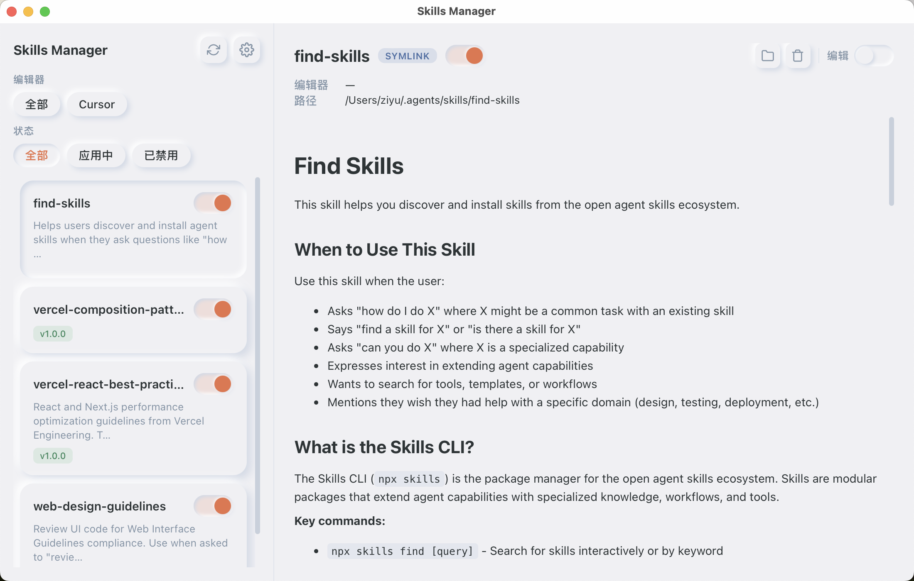
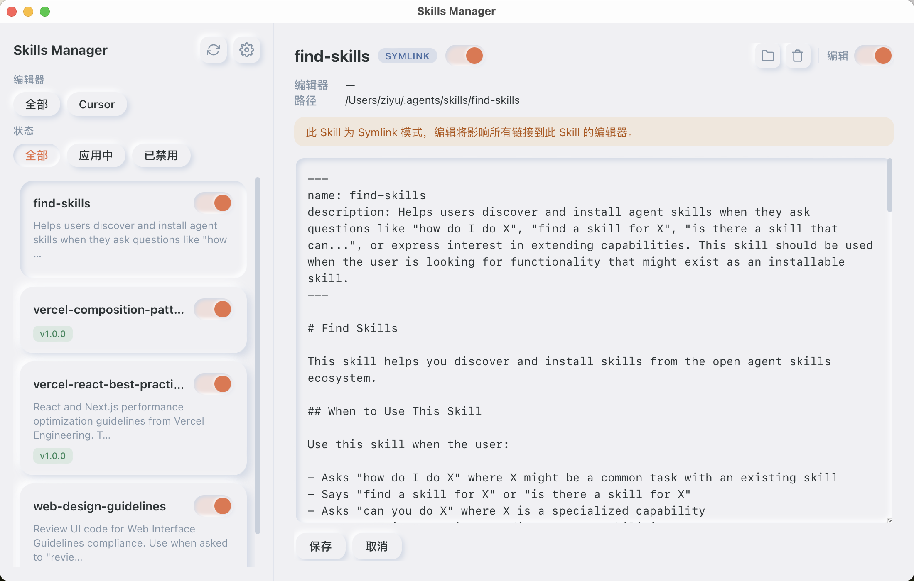

<p align="center">
  
</p>

<h1 align="center">Skills Manager</h1>

<p align="center">
  跨平台桌面应用，统一管理 AI 编辑器的 Skills。
</p>

<p align="center">
  <a href="#功能特性">功能特性</a> |
  <a href="#安装">安装</a> |
  <a href="#开发">开发</a> |
  <a href="./README.md">English</a>
</p>

---

## 功能特性

- 🔍 **多编辑器支持** — 自动检测并管理 Cursor 和 Claude Code 的 Skills。
- 📦 **集中式技能中心** — 统一存放在 `~/.agents/skills/`，符号链接分发到各编辑器。
- 🔀 **一键启用/禁用** — 即时切换 Skill 状态，随时可恢复。
- 📝 **详情 & 编辑** — Markdown 渲染文档，支持原地编辑技能内容。
- 📂 **文件浏览器** — 可折叠目录树浏览 Skill 目录，查看和编辑脚本/引用/模板文件，支持语法高亮。
- 🌐 **多语言** — 在设置面板中切换简体中文和英文界面。
- 🗑️ **卸载** — 彻底删除 Skill，自动清理所有编辑器中的关联。
- 🎨 **拟态风格 UI** — 基于自定义 Vue 组件的柔和现代设计。
- 💻 **跨平台** — 基于 Tauri v2，原生运行于 macOS、Windows 和 Linux。

## 截图预览

<p align="center">
  
</p>

<p align="center">
  
</p>

## 安装

从 [Releases](https://github.com/nicepkg/skills-manager/releases) 页面下载适合你平台的最新版本。

| 平台 | 文件 |
|------|------|
| macOS (Apple Silicon) | `Skills Manager_x.x.x_aarch64.dmg` |
| macOS (Intel) | `Skills Manager_x.x.x_x64.dmg` |
| Windows | `Skills Manager_x.x.x_x64-setup.exe` |
| Linux (Debian/Ubuntu) | `Skills Manager_x.x.x_amd64.deb` |
| Linux (AppImage) | `Skills Manager_x.x.x_amd64.AppImage` |

## 开发

### 环境要求

- [Node.js](https://nodejs.org/) >= 20
- [pnpm](https://pnpm.io/) >= 10
- [Rust](https://www.rust-lang.org/tools/install) >= 1.77
- 平台相关依赖：
  - **macOS**：Xcode 命令行工具（`xcode-select --install`）
  - **Linux**：`libwebkit2gtk-4.1-dev`、`libappindicator3-dev`、`librsvg2-dev`、`patchelf`
  - **Windows**：[Microsoft C++ 生成工具](https://visualstudio.microsoft.com/visual-cpp-build-tools/)、WebView2

### 快速开始

```bash
# 克隆仓库
git clone https://github.com/nicepkg/skills-manager.git
cd skills-manager

# 安装前端依赖
pnpm install

# 启动开发服务器
pnpm tauri dev

# 构建生产版本
pnpm tauri build
```

生产构建产物输出至 `src-tauri/target/release/bundle/`。

### 项目结构

```
skills-manager/
├── src/                    # Vue 3 前端
│   ├── components/         # UI 组件（拟态设计系统）
│   ├── composables/        # Vue 组合式函数（useSkills、useSkillToggle 等）
│   ├── types/              # TypeScript 类型定义
│   └── styles/             # 全局样式
├── src-tauri/              # Rust 后端（Tauri v2）
│   └── src/
│       ├── lib.rs          # 应用入口 & 命令注册
│       ├── commands.rs     # Tauri 命令处理器
│       ├── editor.rs       # 编辑器检测 & 注册表
│       ├── skill.rs        # 技能发现 & SKILL.md 解析
│       ├── toggle.rs       # 启用/禁用/卸载逻辑
│       └── platform.rs     # 平台相关工具
├── scripts/                # 图标生成脚本
└── package.json
```

### 技术栈

| 层级 | 技术 |
|------|------|
| 框架 | [Tauri v2](https://v2.tauri.app/) |
| 前端 | [Vue 3](https://vuejs.org/) + TypeScript |
| 构建 | [Vite 6](https://vite.dev/) |
| 后端 | Rust |
| Markdown 渲染 | [markdown-it](https://github.com/markdown-it/markdown-it) |

## 许可证

[MIT](./LICENSE)
